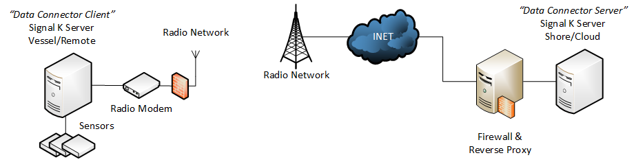

# SignalK Data Connector with Configuration Webapp

A SignalK plugin for secure, encrypted UDP data transmission with compression, featuring a modern web-based configuration interface.



## Features

- **Encrypted Data Transmission**: AES-256 encryption with Brotli compression
- **Client/Server Mode**: Can operate as either data sender (client) or receiver (server)
- **Configurable Delta Timer**: Control data collection frequency
- **Flexible Subscriptions**: Subscribe to specific SignalK data paths
- **Modern Web UI**: Beautiful, responsive configuration interface with custom icon
- **Real-time Configuration**: Edit settings without server restart
- **Webpack Build System**: Modern build pipeline with asset versioning and source maps
- **Connectivity Monitoring**: Optional ping monitoring for client connections

## Installation

1. Clone or download this repository to your SignalK plugins directory:
```bash
cd ~/.signalk/node_modules/
git clone https://github.com/KEGustafsson/signalk-data-connector.git
```

2. Install dependencies:
```bash
cd signalk-data-connector
npm install
```

3. Build the webapp:
```bash
npm run build
```

4. Restart your SignalK server

## Configuration

### Via Web Interface

1. Navigate to `http://your-signalk-server:3000/signalk-data-connector/`
2. Configure delta timer settings
3. Set up subscription paths
4. Save configurations

### Configuration Files

The plugin uses two configuration files in the `config/` directory:

#### `delta_timer.json`
Controls how frequently deltas are collected and sent:
```json
{
  "deltaTimer": 1000
}
```
- `deltaTimer`: Time in milliseconds (100-10000)
- Lower values = more frequent updates, higher bandwidth
- Higher values = better compression ratio, lower bandwidth

#### `subscription.json`
Defines which SignalK data to subscribe to:
```json
{
  "context": "*",
  "subscribe": [
    {
      "path": "navigation.position"
    },
    {
      "path": "navigation.speedOverGround"
    },
    {
      "path": "*"
    }
  ]
}
```
- `context`: SignalK context (e.g., "vessels.self", "*")
- `subscribe`: Array of subscription paths

### Plugin Settings

Configure the plugin through SignalK's admin interface:

#### Server Mode
- **Mode**: Select "server"
- **UDP Port**: Port to listen on (default: 4001)
- **Secure Key**: 32-character encryption key

#### Client Mode
- **Mode**: Select "client"
- **UDP Port**: Server's UDP port
- **Secure Key**: Same 32-character key as server
- **Destination Address**: Server's IP address
- **Connectivity Test**: Optional connection monitoring

## Usage

### Client Setup (Data Sender)
1. Set mode to "client"
2. Configure server address and port
3. Set the same encryption key as server
4. Configure subscription paths for data to send
5. Adjust delta timer for optimal performance

### Server Setup (Data Receiver)
1. Set mode to "server"
2. Configure UDP port
3. Set encryption key
4. Received data will be automatically forwarded to SignalK

### Performance Tuning

**For High-Frequency Data (30-40 deltas/second):**
- Set delta timer to 1000ms
- Results in 30-40 deltas per packet
- Best compression ratio

**For Low-Latency Applications:**
- Set delta timer to 100ms
- Results in 3-4 deltas per packet
- Faster updates but less compression

### Data Rate Comparison

The following chart demonstrates the significant bandwidth savings achieved by this plugin compared to standard WebSocket connections:


**Key Performance Benefits:**
- **1000ms Collection Time**: ~44.1 kb/s (optimal compression)
- **100ms Collection Time**: ~107.7 kb/s (faster updates)
- **WebSocket Realtime**: ~149.5 kb/s (highest bandwidth usage)

The encrypted & compressed UDP approach provides **70% bandwidth reduction** compared to WebSocket connections while maintaining data integrity through AES-256 encryption.

## Architecture

The plugin implements a multi-layer compression and encryption system:

### Client (Data Sender)
1. Collect SignalK deltas over configured time period
2. Compress JSON data with Brotli
3. Encrypt with AES-256
4. Compress encrypted data with Brotli again
5. Send via UDP

### Server (Data Receiver)
1. Receive UDP packet
2. Decompress outer Brotli layer
3. Decrypt with AES-256
4. Decompress inner Brotli layer
5. Forward deltas to SignalK server

## Development

### Building the Webapp
```bash
# Development build with watching (creates unversioned files)
npm run dev

# Production build (creates versioned files with contenthash)
npm run build
```

The build process uses Webpack 5 with:
- Babel for ES6+ transpilation
- CSS extraction and processing
- Asset versioning for cache busting
- Source maps for debugging
- Automatic cleaning of output directory

### API Endpoints

The plugin exposes REST endpoints for configuration:

- `GET /plugins/signalk-data-connector/config/:filename` - Load configuration
- `POST /plugins/signalk-data-connector/config/:filename` - Save configuration

## Security

- Uses AES-256 encryption for all data transmission
- Requires 32-character shared secret key
- Data is compressed before encryption for additional security
- UDP transmission for performance (no connection state)

## Troubleshooting

### Common Issues

1. **Plugin not loading**
   - Check that all dependencies are installed
   - Verify the plugin is in the correct directory
   - Check SignalK server logs for errors

2. **Webapp not accessible**
   - Ensure the webapp was built (`npm run build`)
   - Check that the `public/` directory contains built files
   - Verify SignalK server is serving plugin static files

3. **No data transmission**
   - Verify both client and server use the same encryption key
   - Check UDP port configuration and firewall settings
   - Confirm subscription paths are valid

4. **Poor compression performance**
   - Increase delta timer for better compression ratios
   - Verify Brotli compression is working
   - Check that sufficient data is being collected

### Logging

Enable plugin debug logging in SignalK settings to see detailed operation information.

## Contributing

1. Fork the repository
2. Create a feature branch
3. Make your changes
4. Build and test the webapp (`npm run build`)
5. Submit a pull request

## License

MIT License - see LICENSE file for details.

## Support

For issues and questions:
- Create an issue on GitHub
- Check SignalK community forums
- Review SignalK plugin documentation