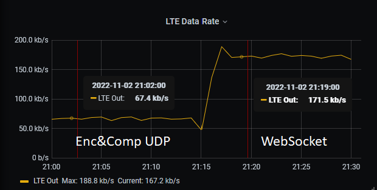

# signalk-data-connector
Signal K server and client solutions for sending deltas over encrypted and compressed UDP channel.

Server configuration
- Server tick box selected
- UDP port
- Secure key (32 characters)

Client configuration
- Server tick box unselected
- UDP port (server UDP port)
- Secure key (32 characters)
- Destination UDP address (server address)
- Connectivity, address for connectivity test, e.g web server
- Connectivity, port for connectivity test, e.g. web server port
- Connectivity, testing interval time in minutes

## Data rate comparison between Encrypted and Compressed UDP data transfer to WebSocket

- ~30-40 deltas/sec, 120 paths 

## Operations
Client:
- client Signal K deltas are collected over pre-defined timeslot (e.g. 100ms)
- collected JSON data is compressed with Brottli
- compressed package is encrypted with AES-256
- encrypted compressed package is once more time compressed with Brottli
- package is sent over UDP to server

Server:
- package is received in server
- Brottli decompression
- decryption
- Brottli decompression
- deltas to Signal K sever
